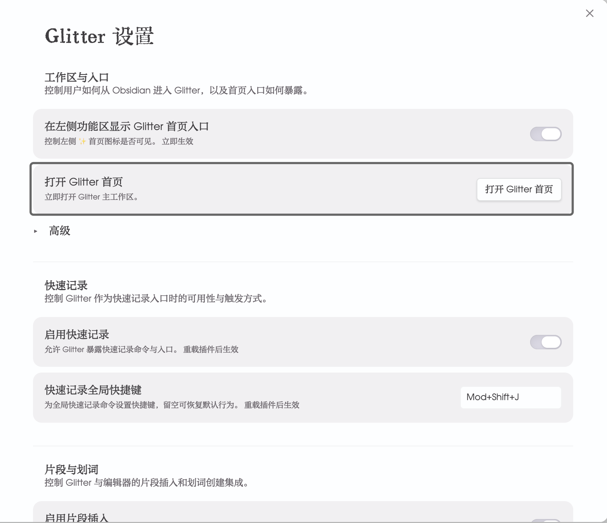
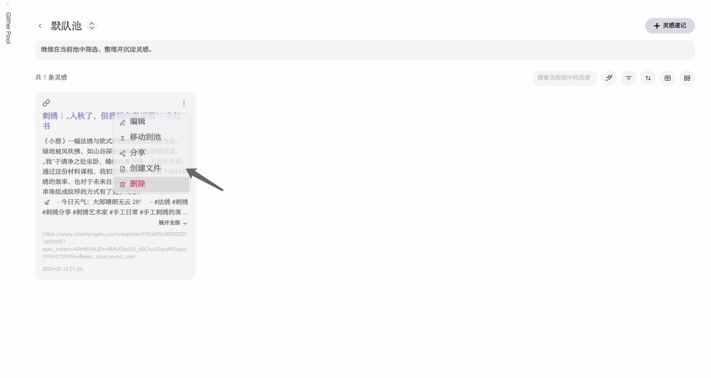

# Glitter

Glitter 是一款面向 Obsidian 的灵感记录插件，适合保存那些值得留下、却不一定需要立刻建成正式笔记的小点子、参考信息和灵感，内容类型涵盖文本、链接、图片/视频。它可以让你先把内容轻量留存，避免 vault 被大量临时笔记塞满；同时便于浏览、查看、整理，等真正需要沉淀时，再也能按需建文件或插回正文。
它的界面颜色、字体、配置、样式完全跟随用户安装的主题，目的在于达到让用户能够沉浸式使用Obsidian的过程中无视觉负担地应用这款插件。

Glitter is an Obsidian plugin for quickly saving ideas, references, and fragments that are worth keeping but do not need to become full notes right away. It supports text, links, images, and videos, giving you a lightweight place to capture them first so your vault does not fill up with throwaway files; later, you can browse, review, organize, turn them into Markdown notes, or insert them back into your writing when they are ready.

Its colors, typography, settings presentation, and overall visual style fully follow the user’s installed Obsidian theme, so the plugin can feel native and visually low-friction during everyday use.

<!-- Future media slot: product overview image or short demo -->

## Why Glitter / 为什么使用 Glitter

### 中文
Glitter 的设计核心，不是让每个想法都立刻服从 Obsidian 的文件结构，而是在“正式笔记”之前，先给灵感一个更轻的落点。

它想拆开两件常被绑在一起的事：**值得留下来**，和 **值得立刻建文件**。你可以先把灵感保存下来，再决定是否分类、是否创建 Markdown 文件、是否插回正文继续写。这样既能减少 vault 里为了速记而产生的大量临时文件，也能让真正重要的灵感更容易被回看、复用和沉淀。

### English
Glitter is not designed around making every thought fit Obsidian’s file structure immediately. Its core idea is to give an idea a lighter landing place before it has to become a formal note.

It separates two decisions that are often forced together: **this is worth keeping**, and **this deserves its own file right now**. You can save first, then decide whether to classify it, turn it into a Markdown note, or bring it back into a note body as a snippet. That keeps your vault from filling with quick-capture clutter while making important ideas easier to revisit, reuse, and develop.

## Quick Start / 快速上手

<!-- Future media slot: quick-start walkthrough -->

### 中文
#### 首次使用
1. 在 Obsidian 中正常启用GLitter插件，在Glitter设置页里**打开Glitter首页**或在Obsidian左侧功能区里找到默认启用的**✨**图标，进入插件首页。

2. 跟随插件**首次流程**，完成第一条灵感的创建。
<video controls src="assets/videos/首次引导流程.mp4" title="首次引导"></video>

#### 使用过程
1. **灵感速记**：点击**灵感速记**，在窗口内输入对应内容后保存，则完成一条灵感的录入。
    - **纯文本**：内容主体优先原则，默认标题为时间戳；
    - **链接**：粘贴链接后可自动识别并补全基础信息；
    - **图片和视频**：附件内添加媒体文件（或粘贴剪切板内的图像），载入内容并保存后，对应媒体文件则保存在仓库的本地默认路径/Glitter/images。
    - 新建文件：默认灵感在插件内以卡片类型存在，但用户可在创建灵感时通过勾选”保存灵感并创建文件”来达到新建灵感的同时也新建一个笔记文件的目的。
    - **快捷键**：默认Mod(Command/Crtl)+Shift+J，可在设置页里更改。
<video controls src="assets/videos/灵感速记.mp4" title="灵感速记"></video>

2. **池**：灵感分类功能，在首页以圆圈涟漪样式呈现，单击后可进入首页。
    - **新建池**：点击**新建池**，输入池分类名称及描述后保存，则完成一个灵感分类的建立；
    - 其它新建路径：灵感速记窗口里面的**切换池**可以新建池；
    - **池样式规则**：默认灵感数量最多的池位于界面中心；池中心的虚实描边虚实默认随机生成。
    - **池编辑**：鼠标停留在池上方3秒，则触发“池独立模式”，右侧按钮可依次进行**池名称编辑**、**池分类删除**；池首页内单击池名称和池描述，也可以触发原位内容更改。
<video controls src="assets/videos/池.mp4" title="池"></video>

3. **灵感卡片**：内容保存后在对应池内生成属于这个灵感的卡片。
    - 卡片管理：卡片更多里可进行编辑、移动、删除、创建为文件/打开文件、查看插入正文位置的操作。
    - 卡片呈现状态：文本内容过长时，文本区域会进行折叠处理；已经创建为独立笔记文件的灵感，卡片左上角的“内容类型图标”的颜色会切换到跟随Obsidian主题设置的强调色。
    - **筛选、整理与查看**：池首页内卡片区域右上角提供对应功能按钮。
        - 按“灵感状态”、“内容类型”、“创建时间”等方式筛选灵感；
        - Markdown格式的阅读视图查看及其整体作为.md笔记文件导出；
        - 批量移动、删除灵感卡片。

4. **片段插入**：写笔记时，可以把已有灵感插入正文，方便引用、延展和继续写作。
    - 笔记正文内右键找到Glitter，选择**插入灵感片段**；
    - 快捷键：Mod(Command/Ctrl)+Shift+I。
<video controls src="assets/videos/片段引用.mp4" title="灵感片段引用"></video>

5. 其他
    - 首页“切换视图”为占位信息，后续会开发首页灵感池多视图切换功能。
    - 卡片的分享功能待开发。

### English
#### First use
1. Enable Glitter in Obsidian as usual, then open the Glitter home page from the Glitter settings tab or click the default **✨** ribbon icon in the left sidebar.
2. Follow the plugin’s **first-use flow** to create your first idea.

#### During use
1. **Quick Capture**: Click **Quick Capture**, enter the content in the modal, and save it to create an idea.
    - **Plain text**: content-first by default, with a timestamp used as the default title.
    - **Links**: paste a link and Glitter can recognize it and fill in basic information automatically.
    - **Images and videos**: add media files as attachments, or paste an image from the clipboard; after saving, the media files are stored in the local default path at `/Glitter/images`.
    - **Create file**: ideas are cards by default, but you can also check **Save idea and create file** to create a note at the same time.
    - **Shortcut**: `Mod (Command/Ctrl) + Shift + J` by default, and it can be changed in settings.
2. **Pools**: Pools are Glitter’s idea categories, shown as ripple-like circles on the home page.
    - **Create a pool**: click **New Pool**, enter the pool name and description, then save.
    - **Other creation path**: you can also create a pool from **Switch Pool** inside the Quick Capture modal.
    - **Pool style rule**: by default, the pool with the most ideas is placed at the center of the page, and the solid/dashed outline style is generated randomly.
    - **Pool editing**: hover over a pool for 3 seconds to enter **independent pool mode**; the buttons on the right let you rename or delete the pool. On the pool home page, clicking the pool name or description also allows inline editing.
3. **Idea cards**: After saving, each idea appears as its own card inside the corresponding pool.
    - **Card management**: from the card’s more menu, you can edit, move, delete, create/open a file, or view where the idea has been inserted into note content.
    - **Card display state**: long text is collapsed automatically; if an idea has already been created as an independent note file, the content-type icon in the upper-left corner of the card switches to the Obsidian theme’s accent color.
    - **Filter, organize, and view**: the upper-right area of the card section on the pool home page provides these actions.
        - Filter ideas by **idea status**, **content type**, **creation time**, and more.
        - Open a Markdown reading view and export the whole set as a `.md` note file.
        - Move or delete idea cards in batches.
4. **Snippet insertion**: While writing notes, you can insert saved ideas back into the note body for quoting, extending, and continuing your writing.
    - Right-click inside a note, find Glitter, and choose **Insert idea snippet**.
    - Shortcut: `Mod (Command/Ctrl) + Shift + I`.
5. Other
    - **Switch View** on the home page is currently placeholder content; support for multiple pool views on the home page is planned for later.
    - The card sharing feature is still under development.

## Install & Update / 安装与更新

### 中文
**安装**

1. 从本仓库最新 Release 下载 Glitter 发布包。
2. 在你的 vault 中创建文件夹：`.obsidian/plugins/glitter-idea-plugin/`
3. 将发布包中的 `manifest.json`、`main.js` 和 `styles.css` 复制到这个文件夹中。
4. 重新打开 Obsidian，或重新加载社区插件。
5. 打开 **Settings → Community plugins**，启用 **Glitter**。

**更新**

1. 下载最新版本的 Glitter 发布包。
2. 用新的 `manifest.json`、`main.js` 和 `styles.css` 替换旧文件。
3. 重新加载 Obsidian，然后确认 Glitter 已正常启用。

### English
**Install**

1. Download the latest Glitter release package from this repository’s Releases page.
2. In your vault, create this folder: `.obsidian/plugins/glitter-idea-plugin/`
3. Copy `manifest.json`, `main.js`, and `styles.css` from the release package into that folder.
4. Restart Obsidian or reload community plugins.
5. Open **Settings → Community plugins** and enable **Glitter**.

**Update**

1. Download the newest Glitter release package.
2. Replace the existing `manifest.json`, `main.js`, and `styles.css` files with the new ones.
3. Reload Obsidian and confirm Glitter is enabled.

## FAQ / Notes / 常见问题与说明

### 中文
**Q: 为什么不直接在 Obsidian 里新建一篇笔记？**  
A: 因为很多灵感值得留下，但并不值得在出现当下就变成正式笔记。Glitter 的作用，就是先把它们轻量保存下来，减少 vault 里因速记产生的大量临时文件。

**Q: Glitter 适合记录哪些内容？**  
A: 适合快速记录文本、链接、图片和视频等内容；如果你粘贴的是链接，Glitter 还可以自动识别并补全相关信息。

**Q: 每条灵感都会自动创建一个 Markdown 文件吗？**  
A: 不会。是否创建文件是可选的，你可以按自己的整理方式决定。

**Q: Pool（灵感池）是做什么的？**  
A: 灵感池是用来分组整理灵感的。你可以按主题、项目、写作阶段或任何适合自己的方式来分类。

**Q: 我可以把已经保存的灵感重新放回笔记正文吗？**  
A: 可以。Glitter 支持把灵感作为片段插入笔记正文，方便在写作时继续展开和引用。

**Q: 这个插件后续会更新什么功能？**  
A: 卡片分享、气泡数据图表、插件视图内其它的微动效。

### English
**Q: Why not just create a note in Obsidian directly?**  
A: Because many ideas are worth keeping without being worth a full note yet. Glitter gives them a lighter place to live first, so your vault does not fill up with quick-capture clutter.

**Q: What kinds of content can Glitter capture?**  
A: Glitter is designed for quickly saving text, links, images, and videos. If you paste a link, it can also recognize it and fill in relevant details automatically.

**Q: Does every idea automatically become a Markdown file?**  
A: No. File creation is optional, so you can decide when an idea should stay lightweight and when it should become its own note.

**Q: What is a pool for?**  
A: A pool is a way to group and organize ideas. You can sort them by topic, project, writing stage, or any structure that fits your workflow.

**Q: Can I bring saved ideas back into my notes later?**  
A: Yes. Glitter supports inserting ideas into note bodies as snippets so they can be reused, referenced, and expanded while you write.

**Q: What features are planned for future updates?**  
A: Planned areas include card sharing, bubble-style data visualizations, and additional subtle motion effects inside the plugin views.
